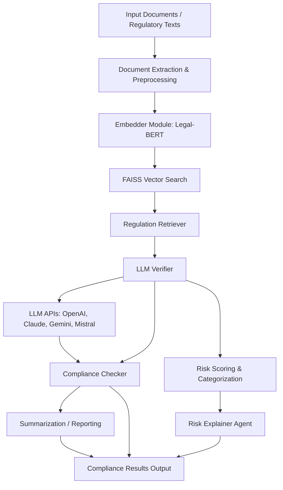

# SEBI-HACK: Compliance & Anomaly Detection Toolkit

## Overview

This project provides a modular toolkit for compliance checking, anomaly detection, and document analysis, tailored for regulatory and financial domains. The core logic resides in the `src` folder, with supporting pre-trained models and indexes for fast, intelligent processing.

---

## Table of Contents
- [Features](#features)
- [Project Structure](#project-structure)
- [Installation](#installation)
- [Usage](#usage)
- [Modules](#modules)
- [Pre-trained Assets](#pre-trained-assets)
- [Contributing](#contributing)
- [License](#license)

---

-## Features

---

## Workflow Diagram


- **Clause Detection**: Identify and extract regulatory clauses from documents.
- **Anomaly Detection**: Detect outliers and suspicious patterns using Isolation Forest.
- **Compliance Checking**: Automated compliance verification against regulatory corpora.
- **LLM Integration**: Leverage large language models for advanced document understanding.
- **Summarization**: Generate concise summaries of lengthy documents.
- **Embedding & Retrieval**: Fast semantic search using FAISS and custom embeddings.

---


## Project Structure

```
SEBI-HACK/
│
├── faiss_index.bin
├── isolation_forest.joblib
├── metadata.pkl
├── pyproject.toml
├── requirements.txt
├── README.md
├── my-app/
├── sebi-genai/
│   ├── pyvenv.cfg
│   ├── etc/
│   │   └── jupyter/
│   ├── Include/
│   │   └── site/
│   ├── Lib/
│   │   └── site-packages/
│   ├── Scripts/
│   │   ├── activate
│   │   ├── activate.bat
│   │   ├── Activate.ps1
│   │   ├── ...
│   └── share/
│       └── jupyter/
│
├── src/
│   ├── __init__.py
│   ├── Clause_detection.ipynb
│   ├── anomaly_detector/
│   │   ├── __init__.py
│   │   ├── ano_detector_agent.py
│   │   └── __pycache__/
│   ├── compliance_checker/
│   │   ├── __init__.py
│   │   ├── compliance_agent.py
│   │   ├── keywords_corpus.json
│   │   ├── llm_verifier.py
│   │   ├── regulation_retriever.py
│   │   ├── risk_explainer_agent.py
│   │   └── __pycache__/
│   ├── data/
│   │   ├── __init__.py
│   │   ├── dataset.ipynb
│   │   ├── __pycache__/
│   │   └── hf_data_providers/
│   ├── embedder/
│   │   ├── __init__.py
│   │   └── ...
│   ├── extraction/
│   │   └── ...
│   ├── llm_provider/
│   │   └── ...
│   ├── pipeline/
│   │   └── ...
│   ├── summerizer/
│   │   └── ...
│   └── sebi_hackathon_modules.egg-info/
│
└── app.py
```

---

## Installation

1. **Clone the repository:**
   ```powershell
   git clone https://github.com/adi0900/SEBI-HACK.git
   cd SEBI-HACK
   ```
2. **Set up the virtual environment:**
   ```powershell
   .\sebi-genai\Scripts\activate
   ```
3. **Install dependencies:**
   ```powershell
   pip install -r requirements.txt
   ```

---


## Usage

- **Use modules in `src/` for custom pipelines, research, or integration into your own applications.**
- **Jupyter Notebooks:**
   Explore `src/Clause_detection.ipynb` and `src/data/dataset.ipynb` for interactive demos.

---

## Modules

### 1. `anomaly_detector/`
- Implements anomaly detection using machine learning (Isolation Forest).
- Key file: `ano_detector_agent.py`

### 2. `compliance_checker/`
- Automated compliance checking, regulation retrieval, and risk explanation.
- Key files: `compliance_agent.py`, `llm_verifier.py`, `regulation_retriever.py`, `risk_explainer_agent.py`, `keywords_corpus.json`

### 3. `data/`
- Data loading, preprocessing, and sample datasets.
- Includes `dataset.ipynb` for data exploration.

### 4. `embedder/`
- Embedding models for semantic search and document understanding.

### 5. `extraction/`
- Document extraction utilities (PDF, text, etc.).

### 6. `llm_provider/`
- Integration with large language models (OpenAI, HuggingFace, etc.).

### 7. `pipeline/`
- End-to-end pipelines combining multiple modules.

### 8. `summerizer/`
- Summarization logic for documents and regulatory texts.

---

## Pre-trained Assets

- **`faiss_index.bin`**: FAISS index for fast vector similarity search (used in retrieval and embedding modules).
- **`isolation_forest.joblib`**: Pre-trained Isolation Forest model for anomaly detection.
- **`metadata.pkl`**: Metadata file (may include feature info, label mappings, or dataset statistics).

---

## Contributing

1. Fork the repository and create your branch.
2. Make your changes and add tests where appropriate.
3. Submit a pull request with a clear description of your changes.

---

## License

This project is licensed under the MIT License. See [LICENSE](LICENSE) for details.


